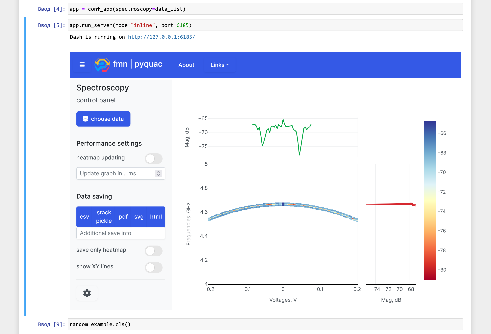

<h1 align="center">
  <a href="https://github.com/ikaryss/pyquac">
    <!-- Please provide path to your logo here -->
    
  </a>
</h1>

<div align="center">
  pyquac
  <br />
  <a href="#about"><strong>Explore the screenshots »</strong></a>
  <br />
  <br />
  <a href="https://github.com/ikaryss/pyquac/issues/new?assignees=&labels=bug&template=01_BUG_REPORT.md&title=bug%3A+">Report a Bug</a>
  ·
  <a href="https://github.com/ikaryss/pyquac/issues/new?assignees=&labels=enhancement&template=02_FEATURE_REQUEST.md&title=feat%3A+">Request a Feature</a>
  .
  <a href="https://github.com/ikaryss/pyquac/issues/new?assignees=&labels=question&template=04_SUPPORT_QUESTION.md&title=support%3A+">Ask a Question</a>
</div>

<div align="center">
<br />

[](LICENSE)

[](https://github.com/ikaryss/pyquac/issues?q=is%3Aissue+is%3Aopen+label%3A%22help+wanted%22)
[](https://github.com/ikaryss)

</div>

<details open="open">
<summary>Table of Contents</summary>

- [About](#about)
  - [Built With](#built-with)
- [Getting Started](#getting-started)
  - [Prerequisites](#prerequisites)
  - [Installation](#installation)
- [Usage](#usage)
- [Roadmap](#roadmap)
- [Support](#support)
- [Contributing](#contributing)
- [Authors \& contributors](#authors--contributors)
- [License](#license)
- [Acknowledgements](#acknowledgements)

</details>

---

## About
While performing qubit calibration experiments - it is necessary to regularly fill out the heatmap graph, as well as fit the curves we can extract from these graphs. Sometimes such measurements can last for hours and if we do not see the result of the measurements immediately, there is a high probability of missing errors related to incorrect configuration of the devices and the measurements will have to be started again.  
We wrote a little [library](pyquac/datatools.py) that allows you to operate with measurements from devices in real time, approximate the curves obtained from such heatmaps, as well as set the corridor of values on the X and Y axis, which we would like to measure so that we do not have to capture the entire heatmap.  

    

We also wrote a web application using the Plotly Dash framework that allows us to visualize the process of building a heatmap in real time. So that the application can handle even big datasets with ease - it uses the just-in-time compiler numba. *Note that the newest version of the app is still under development*.
> **Live heatmap graph data processing provided for FMN laboratory.**  
> This work is a part of metrology of quantum control and measurement in superconducting
qubits.  

> To begin, we know from our circuit design the expected frequency band where the resonator for our qubit lies. We would like to verify the frequency of the resonator and
confirm that it is coupled to the qubit as expected. Due to their relatively strong coupling, if we tune the qubit’s frequency by flux biasing the qubit’s SQUID, we should also
observe shifts in the resonator’s frequency. We observe this effect by performing spectroscopy on the readout resonator: we pulse the readout chain with microwaves while varying the frequency of the microwaves and the flux bias applied to our qubit. It is called resonator spectroscopy.  

> Then we need to understand where the qubit's exited state is lying, so we repeat such a technique. When the dynamic bias places the qubit on resonance with our microwave pulse, the qubit undergoes Rabi oscillations, cycling between the |0〉and |1〉states as we increase the drive amplitude. Because the resonator frequency is different for the two qubit states, we will observe oscillations in the resonator response as a function of drive amplitude.  
> You can see examples of such measurements in the figure section. If you want to learn more about quantum control and measurements - you can read the [dissertation of Zijun Chen](https://escholarship.org/uc/item/0g29b4p0) or other scholarly sources.
<details>
<summary>Screenshots</summary>
<br>

Dash app works directly in Jupyter Notebook

  

---
Some spectroscopy measurements results  
 > single tone spectroscopy and two tone spectroscopy are shown  
   
  

  

</details>

### Built With

> 1. [Numba](https://numba.pydata.org/) for fast data processing. Numba is an open source JIT compiler that translates a subset of Python and NumPy code into fast machine code. 
> 2. [Plotly Dash](https://dash.plotly.com/) for web app building.  
> 3. [Peakutils](https://github.com/lucashn/peakutils) helps our current algorithm to approximate data.

## Getting Started

### Prerequisites

> All project requirements/dependencies are represented in [pyproject.toml](pyproject.toml) file. You can easily install all deps to your anaconda environment with [Poetry](https://python-poetry.org/). So you only need to download Poetry and traj-dist before installation.

### Installation

> 1. clone repo
> 2. create new environment via conda (you can use [environment file](conda_env.yaml))  
> ```conda env create -f conda_env.yaml```
> 3. install dependencies with poetry  
> ``poetry install``

## Usage

> You can see basic example of usage in [random test](examples/random_test.ipynb) file. Also an [example](examples/fmn_spectroscopy.py) of setting the spectroscopy class, taking into account the connected devices is presented. Full documentation in progress

## Roadmap

See the [open issues](https://github.com/ikaryss/pyquac/issues) for a list of proposed features (and known issues).

- [Top Feature Requests](https://github.com/ikaryss/pyquac/issues?q=label%3Aenhancement+is%3Aopen+sort%3Areactions-%2B1-desc) (Add your votes using the 👍 reaction)
- [Top Bugs](https://github.com/ikaryss/pyquac/issues?q=is%3Aissue+is%3Aopen+label%3Abug+sort%3Areactions-%2B1-desc) (Add your votes using the 👍 reaction)
- [Newest Bugs](https://github.com/ikaryss/pyquac/issues?q=is%3Aopen+is%3Aissue+label%3Abug)

## Support


Reach out to the maintainer at one of the following places:

- [GitHub issues](https://github.com/ikaryss/pyquac/issues/new?assignees=&labels=question&template=04_SUPPORT_QUESTION.md&title=support%3A+)
- Contact options listed on [this GitHub profile](https://github.com/ikaryss)


## Contributing

First off, thanks for taking the time to contribute! Contributions are what make the open-source community such an amazing place to learn, inspire, and create. Any contributions you make will benefit everybody else and are **greatly appreciated**.


Please read [our contribution guidelines](docs/CONTRIBUTING.md), and thank you for being involved!

## Authors & contributors

The original setup of this repository is by [Nikolay Zhitkov](https://github.com/ikaryss).

For a full list of all authors and contributors, see [the contributors page](https://github.com/ikaryss/pyquac/contributors).


## License

This project is licensed under the **MIT license**.

See [LICENSE](LICENSE) for more information.

## Acknowledgements

> [Metrology of Quantum Control and Measurement in Superconducting
Qubits](https://escholarship.org/uc/item/0g29b4p0)
